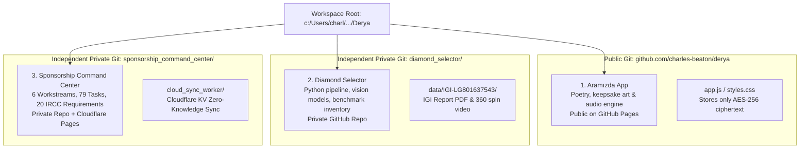

# AGENTS.md — Derya Project Workspace
## Master Guide for LLM Agents & Pair Programmers

> **Workspace Overview**: This repository houses three interconnected projects created by Charles for Derya. They share a unified design ethos inspired by classical Ottoman & Seljuk architecture, Venetian gold, and deep Ebru navy aesthetics, but serve distinct operational and artistic roles.

---

### 1. Multi-Project Architecture & Git Isolation

The workspace is organized into **three distinct projects**, each with strict git isolation rules:



#### The Three Projects

| Project | Location | Git Repository | Deployment Target | Privacy Level |
| :--- | :--- | :--- | :--- | :--- |
| **1. Aramızda** | Root (`index.html`, `styles.css`, `app.js`) | `charles-beaton/derya` | **GitHub Pages** | **Public Repo** (Payload is AES-256 encrypted) |
| **2. Diamond Selector** | `diamond_selector/` | Independent private git | Local Python / FastHTML | **Strictly Private** |
| **3. Sponsorship Command Center** | `sponsorship_command_center/` | Independent private git | **Cloudflare Pages** (`derya-command-center.pages.dev`) | **Strictly Private** (AES-256 + Cloudflare Access) |

---

### 2. Mandatory Git & Privacy Directives for Agents

1. **NEVER Commit Private Subprojects to the Public Repo**:
   - `diamond_selector/`, `sponsorship_command_center/`, and `cloud_sync_worker/` are explicitly listed in the root `.gitignore`.
   - Never run `git add -f` or remove these paths from `.gitignore`.
   - Never commit raw diamond certificates (`IGI-*`), `.mp4`, `.pdf`, or unencrypted schedule manifests to `charles-beaton/derya`.
2. **Independent Commits**:
   - If modifying `diamond_selector/`, commit inside `c:\Users\charl\OneDrive\Documents\Derya\diamond_selector`.
   - If modifying `sponsorship_command_center/`, commit inside `c:\Users\charl\OneDrive\Documents\Derya\sponsorship_command_center`.
   - If modifying Aramızda, commit in the workspace root.

---

### 3. Project 1: Aramızda (Public Keepsake & Poetry)

- **Purpose**: A private poetry booklet written by Charles for Derya (*"İki kalp arasında büyüyen küçük bir dünya"*).
- **Security**: The entire booklet text and images are encrypted client-side with **AES-256-GCM (PBKDF2 SHA-256)** into `const ENCRYPTED_PAYLOAD` in `app.js`. The passphrase is required to read the books.
- **Audio Engine**: 7-track generative ambient audio system (`AUDIO_ENGINE_README.md`) simulating Istanbul shoreline waves, cosmic wind, and Turkish bells using Web Audio API synthesis.
- **Companion Navigation**:
  - The top header (`#appHeader`) and the settings menu (`#settingsMenu`) contain companion buttons linking directly to the Sponsorship Command Center at `https://derya-command-center.pages.dev`.

---

### 4. Project 2: Diamond Selector (Private)

- **Purpose**: An AI-assisted laboratory grown diamond evaluation engine assessing optical performance, cut quality, light return, and defect detection (windowing, bow-tie effect, haze, feathering).
- **Core Files**:
  - `pipeline.py`: Main processing pipeline.
  - `server.py`: Local dashboard server.
  - `config.py`: Thresholds and criteria.
  - `vision/`: Prompts and vision evaluation models.
  - `media/`: Video generation, frame extraction, certificate parsing.
  - `data/`: Real inventory benchmark data, including Derya's specific diamond in `data/IGI-LG801637543/`.
- **Git Repo**: Standalone private git repository (`git branch -M main`).

---

### 5. Project 3: Sponsorship Command Center (Private)

- **Purpose**: Project-control system for Ontario relocation, marriage ceremony, Spousal PR Sponsorship (Inland SCLPC), Open Work Permit, and legal status continuity.
- **Detailed Agent Guide**: Read [sponsorship_command_center/AGENTS.md](file:///c:/Users/charl/OneDrive/Documents/Derya/sponsorship_command_center/AGENTS.md) for full statutory rules.
- **Key Invariants**:
  1. **Ceremony Target**: Fixed strictly to **Friday, October 23, 2026**.
  2. **No Upfront Medical**: Forbidden under IMM 5533; medical instructions (IMM 1017E) issued post-AOR.
  3. **Section 186(u) Maintained Status**: Eliminates routine flagpole / border re-entry.
  4. **Evidentiary Limits**: 20 photos max; 10 pages communication max.
  5. **Cloudflare Sync**: Encrypted state synced to `https://derya-sync.charles-alex-beaton.workers.dev/api/state` using `DERYA_SYNC_KV`.
  6. **Luxury Lock Screen**: `#luxuryLockOverlay` on `index.html` decrypts state in memory.
- **Cloudflare Pages Deployment**:
  ```powershell
  npx wrangler pages deploy sponsorship_command_center --project-name derya-command-center --branch main
  ```

---

### 6. Design & Aesthetic System

Across all three projects, preserve the **Aramızda design philosophy**:
- **Tone**: Quiet, mature masculine energy; protective stewardship, dignity, devotion. No militarism or aggressive jargon.
- **Color Palette**:
  - Ebru Navy: `#0a1118`, `#0e1b29`, `#162536`, `#1b334a`
  - Venetian Gold: `#e5c158`, `#c5a059`, `#ffd973`, `#aa8028`
  - Parchment: `#f5f0e6`, `#ebdcb2`, `#e6dfcc`
  - Status Indicators: Emerald Green `#52c49c`, Muted Amber `#e5a060`, Soft Red `#e06c75`
- **Typography**: `Playfair Display`, `Cormorant Garamond`, `Cinzel`.
- **Icons**: Bespoke SVGs only. Never use emoji characters in production UI.
